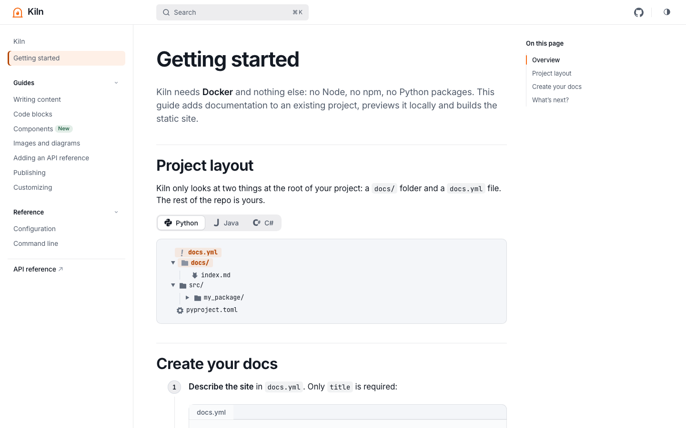

# Kiln

[](https://github.com/Laidwin/kiln/actions/workflows/ci.yml)
[](https://github.com/Laidwin/kiln/releases)
[](LICENSE)

**Markdown in. Docs out.** Kiln turns a `docs/` folder and a `docs.yml` file into a fast, accessible, carefully designed documentation site, for any project, in any language, without adding Node to your repository.

**[Live demo →](https://laidwin.github.io/kiln/)** Kiln's own documentation, built with Kiln.



Kiln packages [Astro](https://astro.build), [Starlight](https://starlight.astro.build) and a custom theme into a Docker image and a reusable GitHub Actions workflow. Projects only contain Markdown and one small config file; Kiln owns the toolchain.

- **Any language:** Python, Java, .NET, Rust, Go… Kiln only reads Markdown and MDX.
- **One config file:** `docs.yml`, validated at startup with line-accurate errors. The Astro config is generated; projects never touch it.
- **A crafted theme:** Inter typography, automatic light and dark modes, one accent color you choose, WCAG AA contrast.
- **Batteries included:** Pagefind search, syntax highlighting for 200+ languages, tabs, asides, steps, file trees, optimized images, and a slot for a pre-generated API reference.

The source of the demo site lives in [`example/`](example/).

## Used by

- [**Soong**](https://github.com/Laidwin/Soong): turns a music video into a lyrics video. [Documentation](https://laidwin.github.io/Soong/)
- [**Lyricsmith**](https://github.com/Laidwin/Lyricsmith): turns a song into timestamped lyrics. [Documentation](https://laidwin.github.io/Lyricsmith/)

## Quick start

At the root of your project, create `docs.yml` and a first page:

```yaml
# docs.yml
title: My project
description: What my project does, in one sentence.
```

```md
<!-- docs/index.md -->
---
title: Welcome
---

Hello from **Kiln**!
```

Preview with live reload on <http://localhost:4321>:

```sh
docker run --rm -p 4321:4321 -v "$PWD":/project ghcr.io/laidwin/kiln serve
```

Build the static site into `site/`:

```sh
docker run --rm -v "$PWD":/project ghcr.io/laidwin/kiln build
```

On Windows PowerShell, use `"${PWD}:/project"`. File watching uses polling, so live reload works with folders mounted from Windows and macOS hosts. Add `site/` to your `.gitignore`.

## Publish to GitHub Pages

1. In the repository settings, under **Pages**, set **Source** to **GitHub Actions**.
2. Add `.github/workflows/docs.yml`:

   ```yaml
   name: Docs

   on:
     push:
       branches: [main]
     workflow_dispatch:

   permissions:
     contents: read
     pages: write
     id-token: write

   jobs:
     docs:
       uses: Laidwin/kiln/.github/workflows/pages.yml@v1
   ```

The site is published at `https://<owner>.github.io/<repo>/`. The base path is taken from the Pages configuration (`/<repo>` for project sites, `/` for user sites and custom domains) unless `docs.yml` sets `base`.

Workflow inputs, all optional:

| Input               | Default                   | Description |
| ------------------- | ------------------------- | ----------- |
| `working-directory` | `.`                       | Folder containing `docs.yml` and `docs/`. |
| `image`             | `ghcr.io/laidwin/kiln:v1` | Kiln image, e.g. `ghcr.io/laidwin/kiln:v1.2.3` for reproducible builds. |
| `api-artifact`      | none                     | Name of an artifact from an earlier job with a pre-generated API reference, published under `/api/`. |

For example, to publish a Javadoc reference alongside the guides:

```yaml
jobs:
  javadoc:
    runs-on: ubuntu-latest
    steps:
      - uses: actions/checkout@v7
      - uses: actions/setup-java@v6
        with: { distribution: temurin, java-version: 21 }
      - run: mvn -B javadoc:javadoc
      - uses: actions/upload-artifact@v7
        with: { name: api, path: target/reports/apidocs }

  docs:
    needs: javadoc
    uses: Laidwin/kiln/.github/workflows/pages.yml@v1
    with:
      api-artifact: api
```

### Other hosts and custom pipelines

The composite action runs Kiln in any job, leaving deployment to you:

```yaml
- uses: Laidwin/kiln@v1
  id: kiln
  with:
    base: /docs                  # optional
    site: https://example.com    # optional
- run: rsync -a ${{ steps.kiln.outputs.site-path }}/ server:/var/www/docs/
```

Inputs: `working-directory`, `command` (`build` or `validate`), `image`, `base`, `site`. Output: `site-path`.

## `docs.yml` reference

```yaml
title: My project                     # required
description: One-sentence summary.    # used by search engines
logo: docs/assets/logo.svg            # relative path; an SVG logo is also the favicon
accent: "#f76b15"                     # quoted hex color; every accent shade derives from it
locale: en                            # interface language: en (default) or fr
base: /my-project                     # base path; defaults to / (or the Pages path in CI)
site: https://example.github.io       # public URL, for canonical links and the sitemap
social:                               # header icons: icon → URL
  github: https://github.com/example/my-project
editLink: https://github.com/example/my-project/edit/main/   # "Edit page" links
poweredBy: true                       # "Built with Kiln" credit in the footer
sidebar:                              # optional: navigation mirrors docs/ by default
  - getting-started
  - label: Guides
    autogenerate:
      directory: guides
  - label: Changelog
    link: https://github.com/example/my-project/releases
```

| Key           | Type | Default | Notes |
| ------------- | ---- | ------- | ----- |
| `title`       | string | none | **Required.** |
| `description` | string | none | |
| `logo`        | path or object | none | A path, `{ src, alt?, replacesTitle? }`, or `{ light, dark, alt?, replacesTitle? }`. Paths are relative to `docs.yml`. |
| `accent`      | hex color | `#f76b15` | `"#rgb"` or `"#rrggbb"`. Lightness is adjusted automatically to keep AA contrast. |
| `locale`      | `en` \| `fr` | `en` | |
| `base`        | path | `/` | Must start with `/`. Takes precedence over `KILN_BASE`. |
| `site`        | URL | none | Takes precedence over `KILN_SITE`. |
| `social`      | map or list | none | Map `icon: url`, or list of `{ icon, href, label? }`. Icons: `github`, `gitlab`, `bitbucket`, `codeberg`, `forgejo`, `azureDevOps`, `discord`, `slack`, `microsoftTeams`, `mastodon`, `blueSky`, `x.com`, `twitter`, `linkedin`, `youtube`, `stackOverflow`, `npm`, `rss`, `email`, `telegram`, `matrix`, `zulip`, `discourse`, `reddit`. |
| `sidebar`     | list | autogenerated | Entries: `"slug"`, `{ slug, label?, badge? }`, `{ label, link, badge? }`, `{ label, items, collapsed? }`, `{ label, autogenerate: { directory }, collapsed? }`. |
| `editLink`    | URL | none | Base URL pointing to the project root in your repository. |
| `poweredBy`   | boolean | `true` | Shows a discreet "Built with Kiln" link at the bottom of every page. Set to `false` to hide it. |

Unknown keys and wrong types are rejected with the line number:

```text
Error: docs.yml is invalid:

  • [line 2] accent: must be a hex color (#rgb or #rrggbb), e.g. "#f76b15"
  • [line 3] unknown key "colour". Allowed keys: title, description, logo, accent, locale, base, site, social, sidebar, editLink, poweredBy
```

### Pages and navigation

- Pages are `.md` or `.mdx` files in `docs/`. `docs/index.md` (or `.mdx`) is the home page; `template: splash` in its front matter gives a landing page with a hero.
- By default the sidebar lists root pages first, then one group per folder. Order pages with `sidebar.order` in their front matter. Files and folders starting with `_` or `.` are ignored.
- Absolute internal links (`/guides/intro/`) are prefixed with `base` automatically, including in MDX components.

### API reference

If an `api/` folder exists next to `docs.yml`, it is published as is under `/api/` and an **API reference** link is added to the sidebar. Generate it with any tool (Javadoc, DocFX, Sphinx, rustdoc, TypeDoc…); it needs an `index.html` at its root. It is not indexed by the site search.

## Command line

```text
Usage: kiln <command> [options]

Commands:
  build      Build the static site into <project>/site  (default)
  serve      Start the dev server with live reload
  validate   Check docs.yml without building anything

Options:
  --project <dir>   Project to document (default: /project)
  --out <dir>       Build output directory (default: <project>/site)
  --port <port>     Dev server port (default: 4321)
  --no-polling      Disable file watcher polling (serve)
```

| Environment variable    | Description |
| ----------------------- | ----------- |
| `KILN_BASE`             | Base path when `docs.yml` has no `base`. |
| `KILN_SITE`             | Public URL when `docs.yml` has no `site`. |
| `KILN_POLLING`          | `false` to disable watcher polling. |
| `KILN_POLLING_INTERVAL` | Polling interval in ms (default `300`). |
| `KILN_LOG_LEVEL`        | Astro log level: `debug`, `info`, `warn`, `error`, `silent`. |

The container hands generated files back to the owner of the mounted folder. You can also run it as yourself with `--user "$(id -u):$(id -g)"`. Exit code `1` means an invalid `docs.yml`, a missing `docs/` folder or a failed build.

## Contributing

The repository layout, how to work on the theme and the release process are described in [CONTRIBUTING.md](CONTRIBUTING.md).

## License

[MIT](LICENSE)
