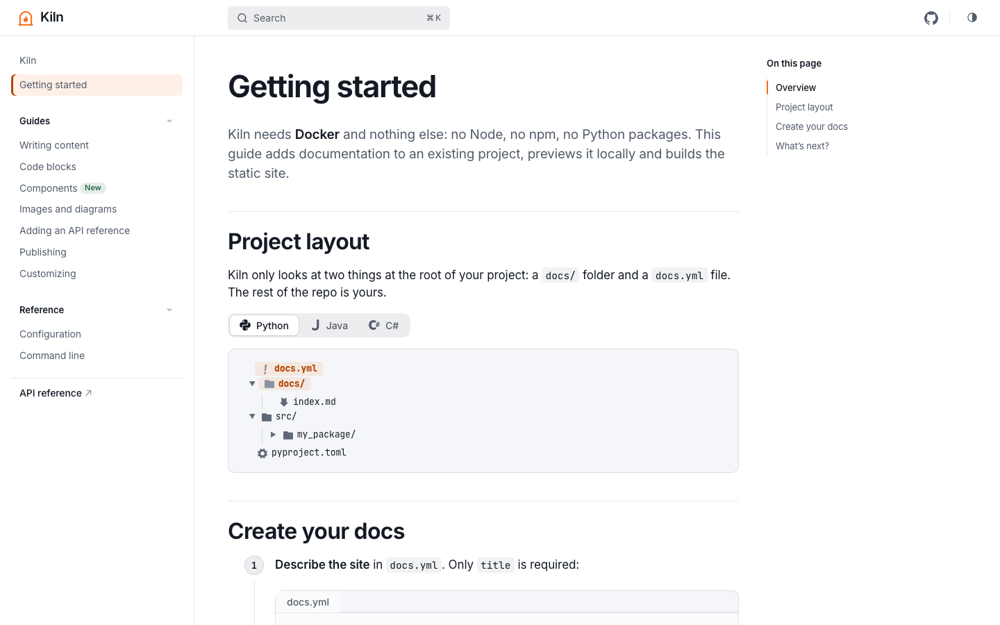
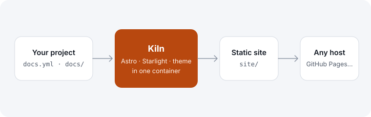

Images placed in `docs/` are optimized at build time: resized, converted to modern formats and given explicit dimensions to avoid layout shifts. Reference them with a path relative to the page.

```md

```

## SVG diagram



## Screenshot


Always write alt text describing what the image shows: screen readers read it aloud, and it is displayed if the image fails to load.
